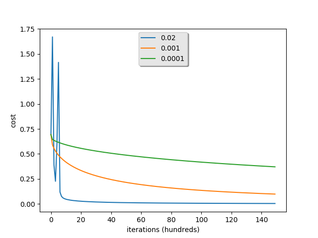

# Classifying Cats with Logistic regression

This is Deeplearning.ai assignment. Here logistic regression is done keeping Neural Network in mind. I have done some modificatin so we can it saves trained model using **pickle** module so that it wond have to again train the model.

## Logistic Regression Model

*image source - Deeplearning.ai specialization* 

## Accuracy Analysis

Bellow is the Accuracy analysis for three different values of learning rate and no of iterations =  15000

|Learning Rate|Train Accuracy|Test Accuracy|
|-------------|-----|----|
| 0.02        |100% |72.0%|
| 0.001|     99.52153110047847 %|68.0 %|
|0.0001|88.99521531100478 %|64.0 %|

Here with learning rate 0.02, Cost during initial interating stages goes high, and becomes somewhat bumpy but at last performs better than 0.001 and 0.0001. 