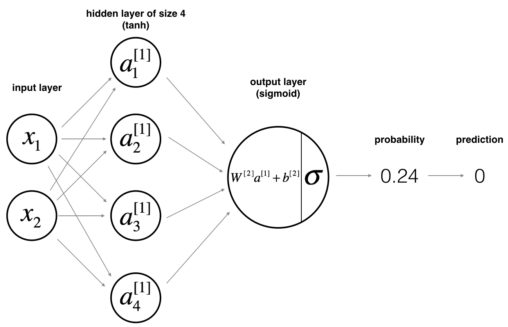
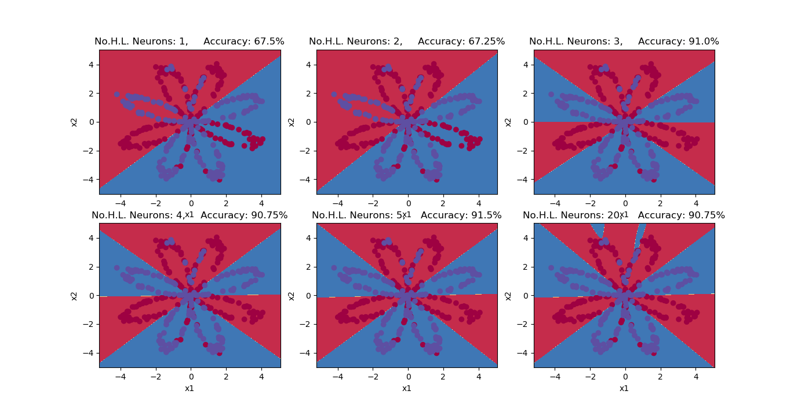
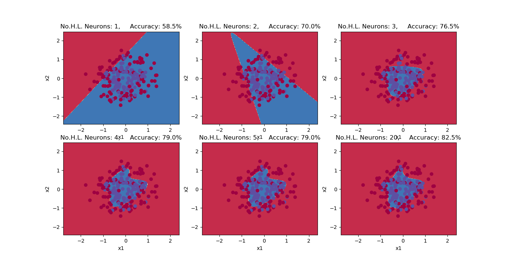
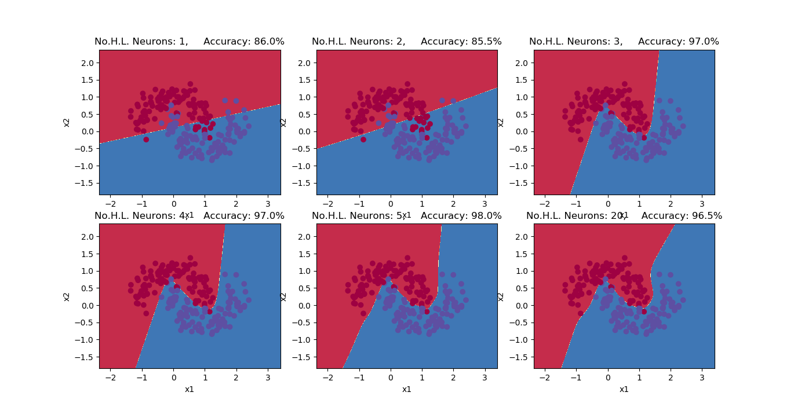
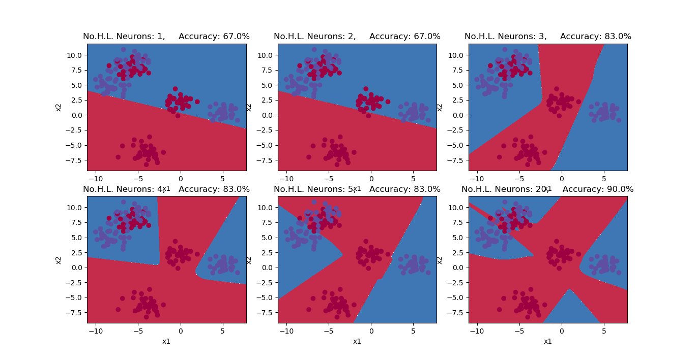
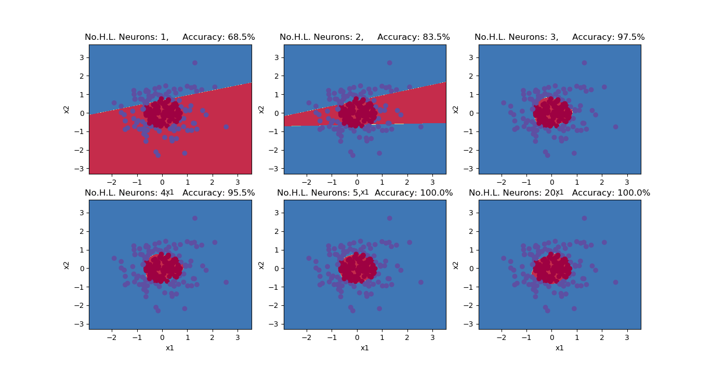

# Classification using Shallow Neural Network

This programing is made using Deeplearning.ai Specialization Course 1 Assignment, I which we implemented Neural Network with one hidden Layer thus called **Shallow Neural Network**. We classfied couple of datasets from **sklearn**.

## Modules used

* Sklearn
* Matplotlib
* Numpy

## Contents

* Main program.py - main program for creation of NeuralNetwork and Its training.
* planar_utils.py - provides sume useful function, and provide main program with datasets made using sklearn.
 
## Neural Network Model

## Backpropagation formulas for neural Network

***Source [Deeplearning.ai specialization](https://www.coursera.org/specializations/deep-learning)***

## Neural Neural Network Accuracy with different datasets and different numbers of Hidden Layer Neurons

### Flower

### Noisy Circles

### Noisy Moons

### Blops

### Gaussian Quantiles

