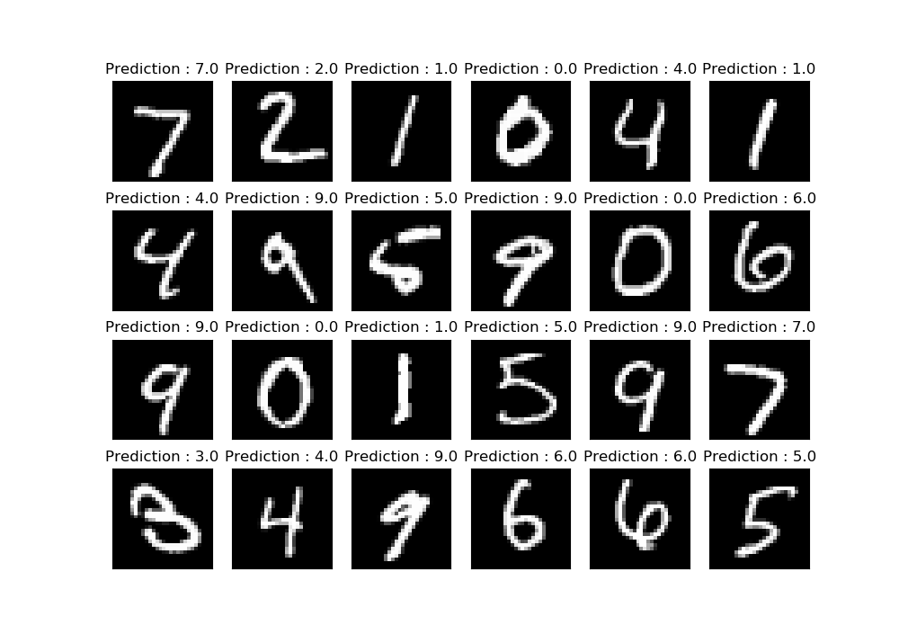
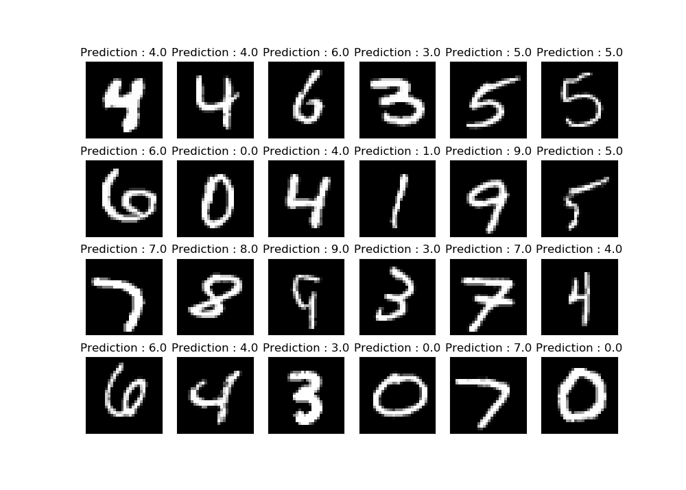

# Handwriting Classification using Deep Neural Network

In this project, the Neural Network Implementation is taken from previous project [Cat Classification Using Deep Neural Network](https://github.com/jimmyahalpara/Machine-and-Deep-Learning/tree/master/Cat%20Classification%20with%20Deep%20Neural%20Network) by just changing the size of input and output layers. We here used **MNIST** handwriting datasets consisting of **60,000 training data** and **10,000 test data**. 
In this project you can create your custom model train it with any number of training data you want and use it against train data, test data or image file. You can also save the Neural Network Model you have trained or even further train saved model. Training using whole 60,000 data becomes really time consuming, but you can train your model using small batches of data , and further train that model with another batch. 

## Modules Used 

* Numpy
* Matplotlib
* Scipy
* PIL
* Pickle
* Skimage

## Contents

* **Main Program.py** - Contains Main Neural Network Implementation
* **dnn_utils_v2.py** - Contains some important functions for Implementation of Neural Network, Forward Propogations, and Backpropagation.
* **dataset.mm** - This file contains MNIST datasets form keras and it is processed to match the model. Saved using pickle module, Data stored in form of (X_train, Y_train),(X_test, Y_test).
* **mainModel.mod** - This is a type of file in which this program saves the model using pickle module. Model is save in (parameters, layer_dimensions) format.

## Some Examples

