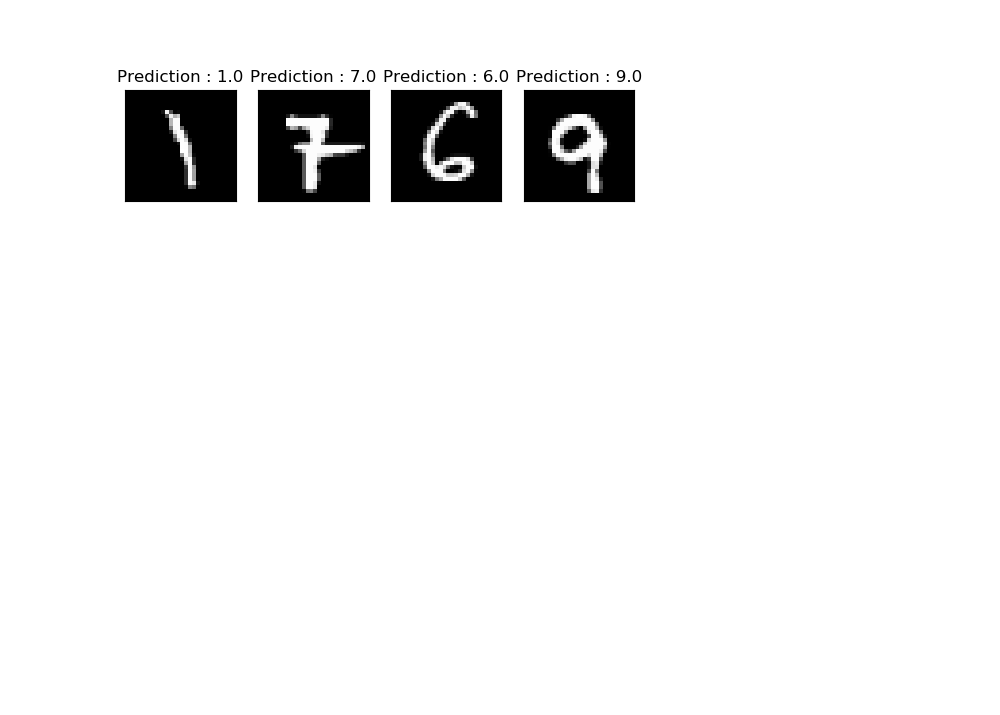

# Handwriting Classification using Deep Neural Network

In this project the Neural Network Implementstion is taken from previous project [Cat Classification Using Deep Neural Network](https://github.com/jimmyahalpara/Machine-and-Deep-Learning/tree/master/Cat%20Classification%20with%20Deep%20Neural%20Network) and just changing the size of input and output layers. We here used **MNIST** handwriting datasets consisting of **60,000 training data** and **10,000 test data**. 
In this project you can create your custom model train it with any number of training data you want and test it against train, test and any image file. You can also save the Neural Network Model you have trained and even further train you model. Training form whole 60,000 data becomes really time consuming, but you can train your model using small batches of data , and further train that model with another batch. 

# Usage

* When you first start the program, you have to select any model to work, you can select option 1 to import some model from any file or option 2 to make new one an train it. After selecting you can Start using it on Test data, Train data or any image file. You can also further train the model you have selected by selecting Option 6
* When ever you train any new model or train same model further, program asks for model name and saves it in the file with **.mod** extension. 

## Modules Used 

* Numpy
* Matplotlib
* Scipy
* PIL
* Pickle
* Skimage

## Contents

* **Main Program.py** - Contains Main Neural Network Implementation
* **dnn_utils_v2.py** - Contains some important functions for Implementation of Neural Network, Forward Propogations, and Backpropagation.
* **dataset.mm** - This file contains MNIST datasets form keras and it is processed to match the model. Saved using pickle module, Data stored in form of (X_train, Y_train),(X_test, Y_test).
* **mainModel.mod** - This is a type of file in which this program saves the model using pickle module. Model is save in (parameters, layer_dimensions) format.

## Some Examples

